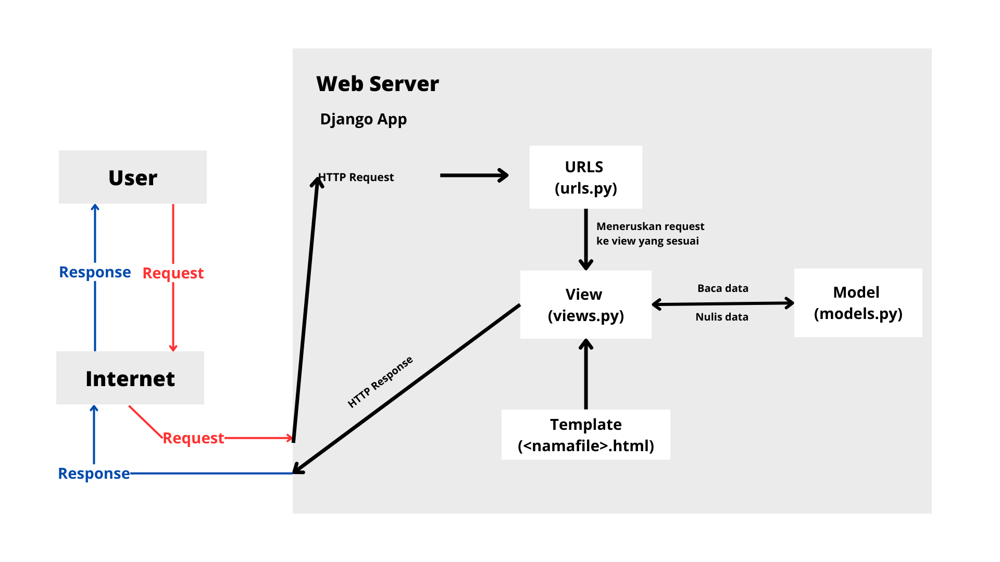

## link website = https://future-fashion.adaptable.app/

## TUGAS 2

1. berikut implementasi yang saya lakukan: 
    - membuat proyek baru django baru dengan membuat direktori, mengaktifkan virtual environment, dan menjalankan perintah django-admin startproject future_fashion .
    - membuat aplikasi main dengan menjalankan perintah python manage.py startapp main dan menambahkan 'main' ke INSTALLED_APPS yang ada di settings.py direktori proyek
    - membuat routing dengan menambahkan path('main/', include('main.urls')) di urls.py proyek agar setiap urls yang ada di main bisa diakses
    - membuat model pada aplikasi main dengan nama Item yang punya atribut berupa name, amount, description, dan price
    - membuat fungsi di views.py bernama show_main yang dimana show_main menampilkan main.html yang ada di templates. saya memanfaatkan context untuk menampilkan nama dan kelas
    - membuat file urls.py di aplikasi main yang berisi app_name = 'main' serta urls pattern diri sendiri dengan menyertakan suatu fungsi di view
    - melakukan deployment dengan mendeploy repositori github saya yang bernama future_fashion  
    - membuat file bernama README.md yang berisi tautan app adaptable beserta jawaban uraian
    - tambahan selain yang di tutorial: saya membuat suatu direktori bernama static untuk menampung data-data dan gambar yang ingin digunakan di web. saya juga mendefinisikan konfigurasi url staticnya di settings.py. ada dibagian paling bawah dengan tagar static

2. berikut bagan request client ke web aplikasi Django
 

 
ketika user melakukan browser (mengirim request), internet akan mengirim http/https request ke web server. aplikasi django yang ada di web server pun mengelola request dengan mengarahkan ke view yang dikehendaki. view yang menjadi jembatan antara model dan template akan mendapat dan mengirimkan data ke model serta mendapat tampilan dari template. kemudian view akan mengirimkan http response berupa html yang nantinya web server akan mengembalikan response tersebut ke user untuk ditampilkan di browser. 

3. virtual environment memungkinkan pengembangan dari suatu proyek yang kita kerjakan inklusif. maksudnya apa yang kita kerjakan di suatu proyek django yang menggunakan virtual environment tidak akan mempengaruhi proyek lainnya seperti dependency yang diinstall dan lain sebagainya. 

Kita tetap bisa membuat aplikasi web berbasis django tanpa menggunakan venv. tetapi risikonya ada kemungkinan crash karena kebutuhan tiap2 proyek ada bisa jadi berbeda

4. MVC merupakan singkatan dari Model View Controller. Model berperan untuk menyimpan data, view berperan sebagai tempat untuk menyimpan presentasi tampilan website, dan controller mengatur alur tampilan yang ada di view (sebagai jembatan antara model dan view)

MVT merupakan singkatan Model View Template. Model berperan untuk menyimpan data, template berperan sebagai tempat untuk menyimpan tampilan, dan view mengatur alur tampilan yang ada di template (jembatan antara template dan model)

perbedaan MVC dan MVT hanya terletak di istilah tetapi arsitekturnya sama. perbedaannya Controller di MVC bertindak seperti View di MVT, sedangkan View di MVC berperan seperti Template di MVT. 

istilah MVC merupakan istilah umum yang digunakan di dunia pengembangan perangkat lunak, sedangkan MVT merupakan istilah lain dari MVC yang digunakan di komunitas django

MVVM merupakan singkatan dari Model View ViewModel. Model berperan untuk menyimpan dan mengelola data, view berperan untuk menampung tampilan, dan ViewModel berperan jembatan antara Model dan View serta tempat logika tampilan. 

ViewModel tidak hanya berperan sebagai jembatan antara Model dan View tetapi juga tempat untuk mengelola logika tampilan sehingga Model bisa fokus pada data saja, pemrosesan datanya diserahkan pada ViewModel. Intinya pemisahan View dan Model di ViewModel arsitektur MVVM lebih ketat dibanding di arsitektur MVC. 

## TUGAS 3

1. Form POST digunakan untuk mengirimkan data ke server sedangkan form GET digunakan untuk mengambil data dari server

2. Perbedaan XML, JSON, dan HTML. 

XML yang merupakan singkatan dari Extensible Markup Language memiliki struktur seperti tree yang mana dokumennya dimulai dari root, branch, lalu ke leaves. contoh dari XML: 

<movies>
    <movie1>
        <title>Jungle Book</title>
        <genre>Fantasy</genre>
        <age>12+</age>
    </movie1>
    <movie2>
        <title>Spiderman</title>
        <genre>Science Fiction</genre>
        <age>13+</age>
    </movie2>
    <movie3>
        <title>Ironman</title>
        <genre>Action</genre>
        <age>18+</age>
    </movie3>
</movies>

JSON yang merupakan singkatan dari JavaScript Object Notation terdiri dari key dan value, memiliki struktur seperti dictionary di python. contoh dari JSON: 

{
    "movie1": {
        "title": "Jungle Book", 
        "genre": "Fantasy",
        "age": "12+"
    }, 
    "movie2": {
        "title": "Spiderman",
        "genre": "Science Fiction",
        "age": "13+"
    }, 
    "movie3": {
        "title": "Ironman",
        "genre": "Action",
        "age": "18+"
    }
}

HTML yang merupakan singkatan dari HyperText Markup Language biasa digunakan untuk menentukan struktur suatu halaman web. contoh dari HTML:

    <h1>Future Fashion</h1>
    <h5>Name: </h5> 
    
Rachel Mathilda

    <h5>Class: </h5>
    
PBP D

3. Karena format dari JSON sederhana dan ringkas. JSON mudah dibaca oleh manusia dan mudah untuk diproses di suatu program karena strukturnya sederhana. Selain itu, JSON juga mudah untuk loading data karena ukuran filenya kecil. Oleh karena 2 alasan di atas, JSON sangat marak digunakan dalam pertukaran data antar aplikasi web 

4. Cara saya mengimplementasikan checklist:
    - sebelum mengubah file, saya mengaktifkan virtual environment terlebih dahulu 
    - selanjutnya saya membuat base.html di suatu direktori di root bernama templates
    - kemudian saya membuat sebuah form di forms.py yang ada di app main dimana forms.py merupakan struktur form yang memiliki class ItemForm dimana ItemForm memiliki fields yang isinya name, price, amount, dan description 
    - setelah itu saya nenambahkan fungsi create_item di views.py aplikasi main. fungsi ini berfungi untuk menghasilkan formulir ItemForm dan menampilkannya di halaman create_product.html. setelah form berhasil disimpan nantinya fungsi akan mengarahkan untuk kembali ke halaman utama 
    - selanjutnya di fungsi show_main, menambahkan items yang merupakan semua objek Item kemudian menambahkannya di context 
    -  selanjutnya saya menambahkan halaman html di templates yang ada di main dengan nama create_item.html. isinya merupakan extend dari base.html dan form yang menggunakan method POST 
    - selanjutnya di main.html saya menambahkan iterasi setiap item yang ada di items untuk menampilkan tiap2 item yang sudah ditambahkan. Tidak seperti di tutorial 2 dimana item2 nya disajikan dalam bentuk tabel, saya membuatnya dalam bentuk card (di dalam suatu persegi)
    - setelah itu, di views.py saya membuat fungsi berupa: 
        * show_xml yang mengembalikan setiap objek Item dalam bentuk XML
        * show_json yang mengembalikan setiap objek Item dalam bentuk JSON
        * show_xml_by_id yang mengembalikan objek Item berdasarkan idnya. Jadi data yang dikembalikan di filter dulu berdasarkan id. Bentuk data yang dikembalikan adalah XML 
        * show_json_by_id yang mengembalikan objek Item berdasarkan id dalam bentuk JSON 
    - setelah itu saya membuat routing2 nya di urls.py fodler main dengan mengimport fungsi create_item, show_xml, show_json, show_xml_by_id, dan show_json_by_id. Setelah itu saya membuat path2nya dari ke 5 fungsi di atas 

4. Bukti hasil mengakses ke 5 URL di Postman 
